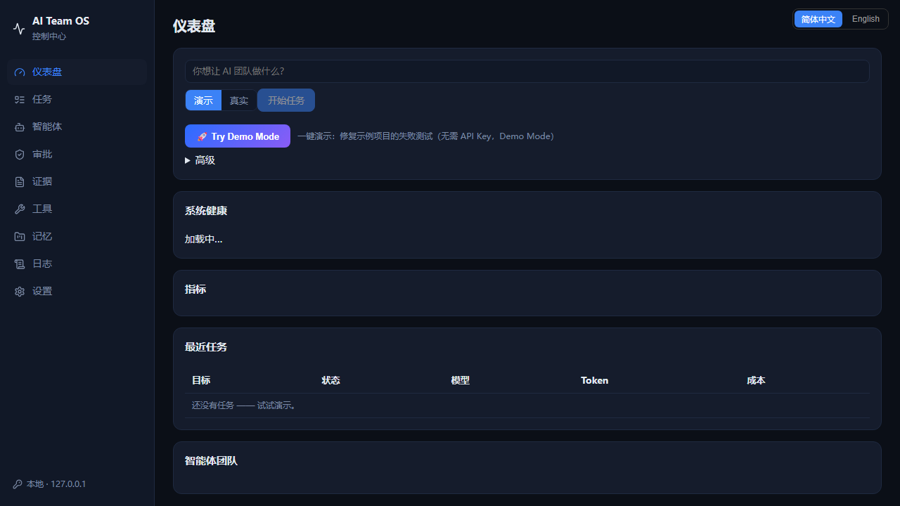
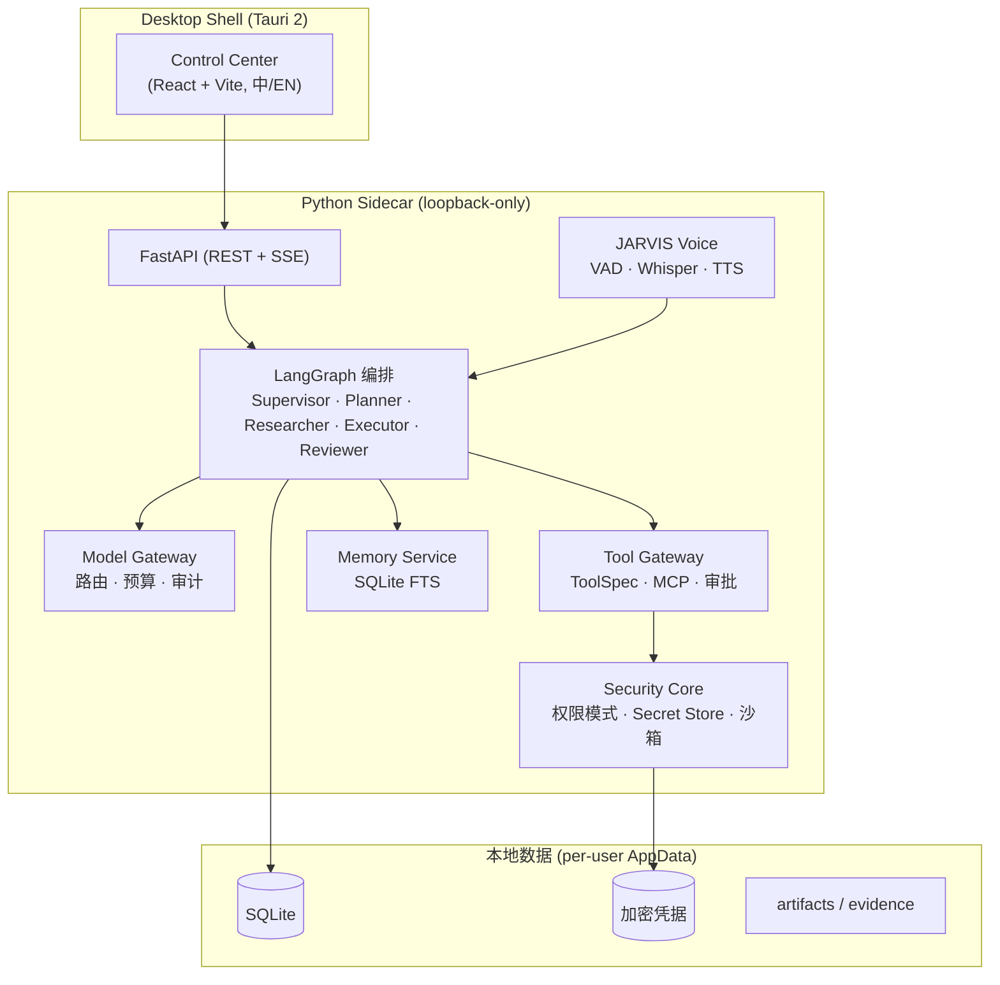
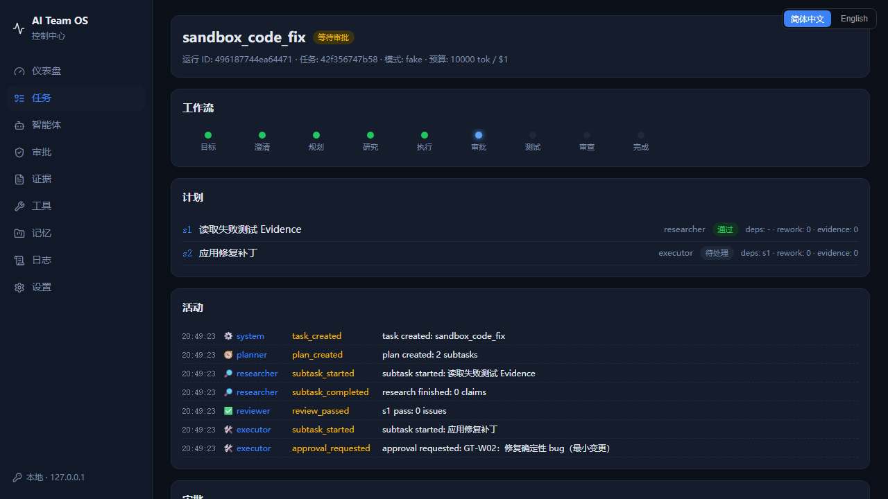
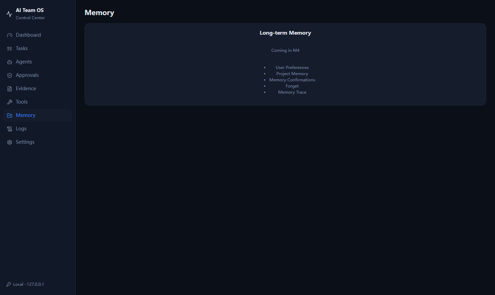
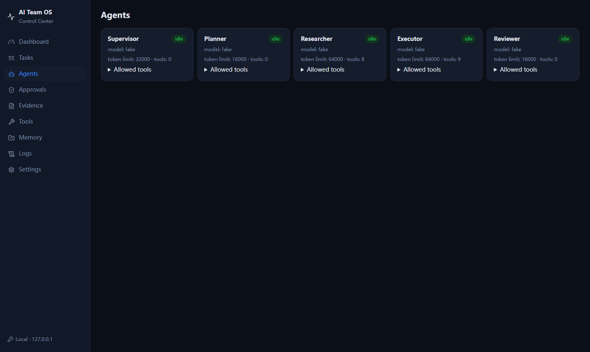
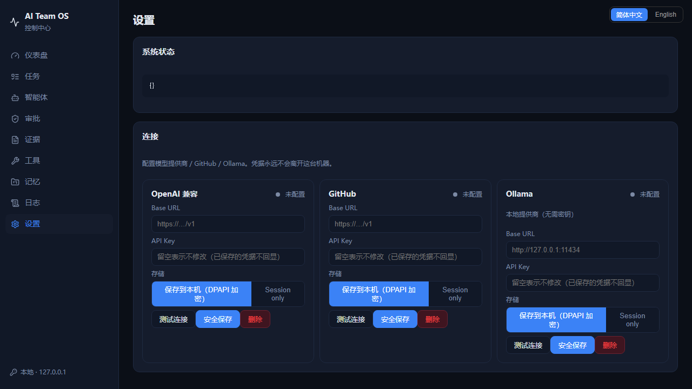
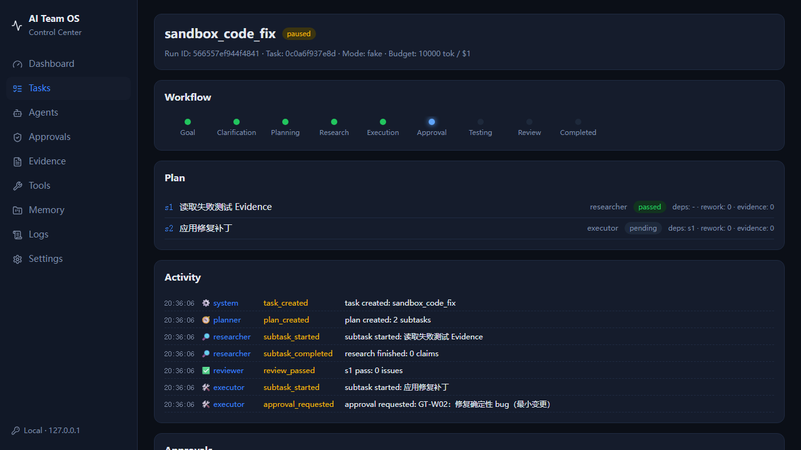

# AI Team OS

<div align="center">

**一个本地优先、受治理的多智能体协作团队平台（Windows Desktop / Web）**


</div>

你只需要用一句话提出目标，AI Team OS 自动完成**意图理解 → 记忆检索 → 计划制定 → 多智能体分工执行 → 事实与产物审查 → 失败定向返工 → 成本与证据全程记录**的完整闭环。

当前为 **Developer Preview 0.1.0**：可安装的 Tauri 桌面应用，内置双语 Control Center、JARVIS 本地语音与桌面视觉、受治理长期记忆、多 Provider 模型路由，以及持久化的 Safe / Standard / Maximum 三档权限模式。

**M7-A4 COMPLETE**：Background Jobs、Condition Watch Runtime、Notification Runtime 已完成稳定实现；A4A/A4B/A4C checkpoint chain 已建立。



## 核心特性

- **多智能体团队**：Supervisor / Planner / Researcher / Executor / Reviewer 五角色，LangGraph 编排，Checkpoint 持久化，中断可恢复，失败定向返工（不无限讨论）。
- **两大收口网关**：所有模型调用经 **Model Gateway**（角色级路由、多 Provider 适配、统一预算与审计），所有工具调用经 **Tool Gateway**（ToolSpec + MCP 同构接入、只读策略、风险分级、人工审批）。
- **受治理安全模型**：Safe / Standard / Maximum 三档权限模式，高风险操作确定性硬拦截 + 人工审批，危险工具任何 LLM 都无法绕过。
- **本地优先语音（JARVIS）**：VAD 活动检测 + 可选唤醒词 + 本地 Whisper 转写 + SAPI 语音回复；原始音频绝不落盘；`STOP` 等指令为确定性本地匹配。
- **桌面视觉与控制**：Windows UIA 可访问性树 + 多显示器截图 + OpenCV 确定性定位，全部经权限与审批收口。
- **受治理长期记忆**：SQLite FTS 检索、记忆提案需人工确认、来源与版本可追溯，防记忆投毒。
- **用量观测站**：Provider 实测 Token 用量（含缓存/推理明细）、成本分解、上下文窗口状态、诊断调用分离。
- **双语界面**：简体中文 / English 一键切换的 Control Center（Dashboard / 任务 / 记忆中心 / 设置）。

## 架构



完整组件职责、任务时序图与权限矩阵见 [docs/architecture/OVERVIEW.md](docs/architecture/OVERVIEW.md)。

## 截图

| 首页（中文） | 任务与审批 | 记忆中心 |
| --- | --- | --- |
|  |  |  |

| Agent 活动 | 设置与连接 | 任务详情 |
| --- | --- | --- |
|  |  |  |

## 快速开始

### 前置要求

- Windows 10/11，Python 3.11+
- 无需 API Key 即可体验 Demo 模式

### 方式一：源码运行（Demo，无需任何 Key）

```bash
python -m venv .venv
.venv/Scripts/pip install -e ".[dev]"
.venv/Scripts/ai-team-os run "你好，请介绍一下你自己" --budget-tokens 5000
```

或启动 Web 控制台（自动打开 `http://127.0.0.1:5173`）：

```powershell
scripts\start_ai_team_os.ps1
```

首页输入 `sandbox_code_fix`（Project 填 `sample-python`）→ **Start Task**，即可观看 Planner 拆解、Agent 活动、Diff、测试与 Reviewer 的完整流程。

### 方式二：真实模型

1. 启动后进入 **Settings → Connections**。
2. OpenAI Compatible 卡片填入 Base URL 与 API Key（兼容 OpenAI / DeepSeek / 任意中转端点；本地可选 Ollama）。
3. 凭据可选择 **本机加密保存** 或 **仅本次会话**；点 **Test Connection** 验证后保存。
4. 首页输入任务（如 `github_compare_team`），Model Mode 选 **Real** → **Start Task**。

密钥只从加密 Secret Store 或环境变量读取，永不写入仓库文件。

### 权限模式

| 模式 | 行为 |
| --- | --- |
| **Safe** | 只读与低风险操作自动执行；写入、测试、电脑状态变化需询问 |
| **Standard**（默认） | 普通开发/调研自动完成；删除、外部发送、系统修改需询问 |
| **Maximum** | 目标内大多数操作自动执行；密码、Secret、UAC、核心安全与 STOP 不可绕过 |

### 命令行

```bash
ai-team-os run "调研 LangGraph 与 CrewAI 的选型对比" --budget-tokens 5000   # 运行任务
ai-team-os status <task_id>            # 任务状态
ai-team-os approve <approval_id>       # 批准高风险操作
ai-team-os providers                   # Provider 与角色路由
ai-team-os provider-health             # Provider 健康状态
ai-team-os tools                       # 可用工具列表
```

## 项目结构

```
app/
  agents/          五角色（Supervisor/Planner/Researcher/Executor/Reviewer）
  core/            状态模型、预算、验收、配置
  gateway/         Model Gateway / Tool Gateway
  memory/          记忆策略、SQLite FTS、检索与上下文治理
  security/        权限模式、Secret Store、审计
  tools/           ToolSpec 与工具实现
  api/             FastAPI（REST + SSE）
  voice/           JARVIS 语音（VAD/唤醒词/Whisper/TTS）
  windows_control/ Windows UIA 动作层
  desktop_vision/  桌面视觉（截图 + OpenCV）
  usage/           用量与上下文观测
web/               Control Center（React + Vite + TypeScript，中/EN）
src-tauri/         Tauri 2 桌面壳（托盘、安装器）
scripts/           启动、验收、打包脚本
tests/             pytest 测试套件
docs/              架构 / ADR / 安全 / 操作 / UI 文档
```

## 测试

```bash
.venv/Scripts/pytest
```

- 53 个测试文件、691 个用例：权限拦截、硬预算、Checkpoint 恢复、脱敏、沙箱、记忆、语音、桌面视觉等，全部离线可重复。
- 详细测试报告与发布前修复记录：见 [docs/TEST_REPORT.md](docs/TEST_REPORT.md)。
- CI（GitHub Actions）：Python 3.11/3.12 下 `ruff` + `mypy` + `pytest`，见 [.github/workflows/ci.yml](.github/workflows/ci.yml)。

## 文档

| 主题 | 位置 |
| --- | --- |
| 架构总览 | [docs/architecture/OVERVIEW.md](docs/architecture/OVERVIEW.md) |
| 架构决策记录（ADR） | [docs/adr/](docs/adr/) |
| 安全模型 | [docs/security/](docs/security/) |
| 用户指南 | [docs/ui/USER_GUIDE.md](docs/ui/USER_GUIDE.md) |
| 操作手册 | [docs/operations/](docs/operations/) |
| 发布说明 | [docs/releases/](docs/releases/) |

## 开源合规

本项目基于 MIT 许可证发布；第三方依赖与开源组件选型、许可证合规审计见 [docs/reuse/](docs/reuse/) 与 [docs/research/](docs/research/)。

## License

[MIT](LICENSE) © 2026 AI Team OS contributors
