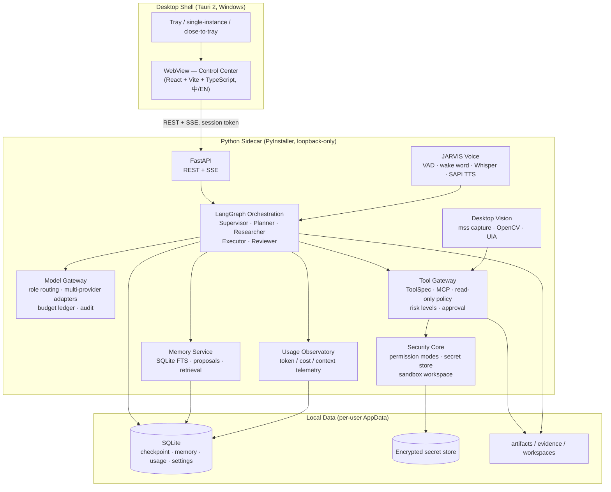
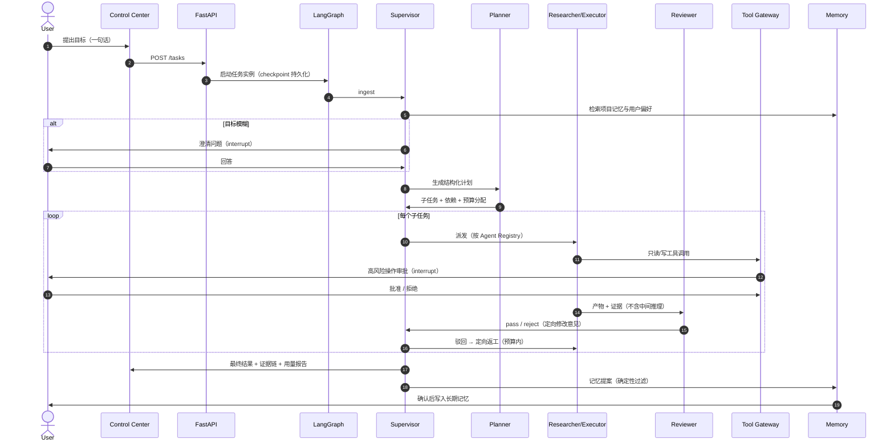

# AI Team OS — Architecture Overview

> Public-facing overview of the implemented system. Design decisions are recorded in
> [docs/adr](../adr/); milestone-specific deep dives live in this directory.

## Design principles

- **Thin frontend, governed core** — the web UI is a control surface; all business logic,
  security, and budget enforcement live in the Python core.
- **Two chokepoints** — every model call goes through the **Model Gateway** (single budget/audit
  ledger) and every tool call through the **Tool Gateway** (authn → budget → approval → execute →
  evidence).
- **Deterministic security** — permission modes, approval gates, budgets, and sandbox boundaries
  are enforced by deterministic code. The LLM never owns a security decision.
- **Local-first** — loopback-only API, per-launch session token, on-device SQLite, no telemetry,
  no cloud dependency.

## System components

## Task lifecycle

## Agent roles

| Role | Responsibility | Key constraints |
| --- | --- | --- |
| Supervisor | 持有"当前该做什么"决策：选 agent、派发、处理失败/驳回 | 不执行具体工作；硬步数上限；禁止 agent 互调 |
| Planner | 目标 → 结构化计划（子任务、依赖、预算分配） | 输出经 schema/无环/预算校验 |
| Researcher | 只读调研：GitHub、Web、本地文件、MCP 证据采集 | 只读工具；证据落盘 |
| Executor | 实施动作：读写沙箱工作区、补丁、跑测试 | 写操作限沙箱；危险操作硬拦截 |
| Reviewer | 独立审查：确定性校验 + LLM 评审 | 只读角色；不接收 Executor 中间推理 |

## Permission modes

| Mode | Behavior |
| --- | --- |
| **Safe（安全）** | 只读与真正低风险操作自动执行；写入、测试、电脑状态变化需询问 |
| **Standard（标准，默认）** | 普通开发/调研自动完成；删除、外部发送、系统修改、敏感行为需询问 |
| **Maximum（最高权限）** | 目标内大多数操作自动执行；密码、Secret、UAC、核心安全系统与 STOP 不可绕过 |

模式持久化保存，跨任务生效；所有高风险审批记录审计日志。

## Voice (JARVIS) and desktop control

- **Voice path**: `sounddevice/WASAPI → 16 kHz bounded queue → Silero VAD → openWakeWord (optional) / push-to-talk → Whisper (local) → transcript → Supervisor`. Raw audio never persists.
- **Deterministic intents**: `STOP / Cancel / Pause / Reject` 是精确本地匹配，不经过 LLM；语音不用于审批高风险操作。
- **Desktop control**: Windows UIA 可访问性树 + mss 多显示器截图 + OpenCV 确定性视觉定位（模板/颜色/轮廓），全部经 Tool Gateway 权限与审批收口。

## Data & privacy

- 所有状态在本机：SQLite（checkpoint、记忆、用量、设置）+ 加密 Secret Store（凭据）+ 文件系统（产物/证据/沙箱工作区）。
- API 仅监听 `127.0.0.1`，每次启动生成随机 48 字符会话令牌，无固定端口/令牌。
- 无遥测、无云依赖；真实模型由用户自行配置 Provider（OpenAI 兼容端点、DeepSeek、Ollama 等）。
