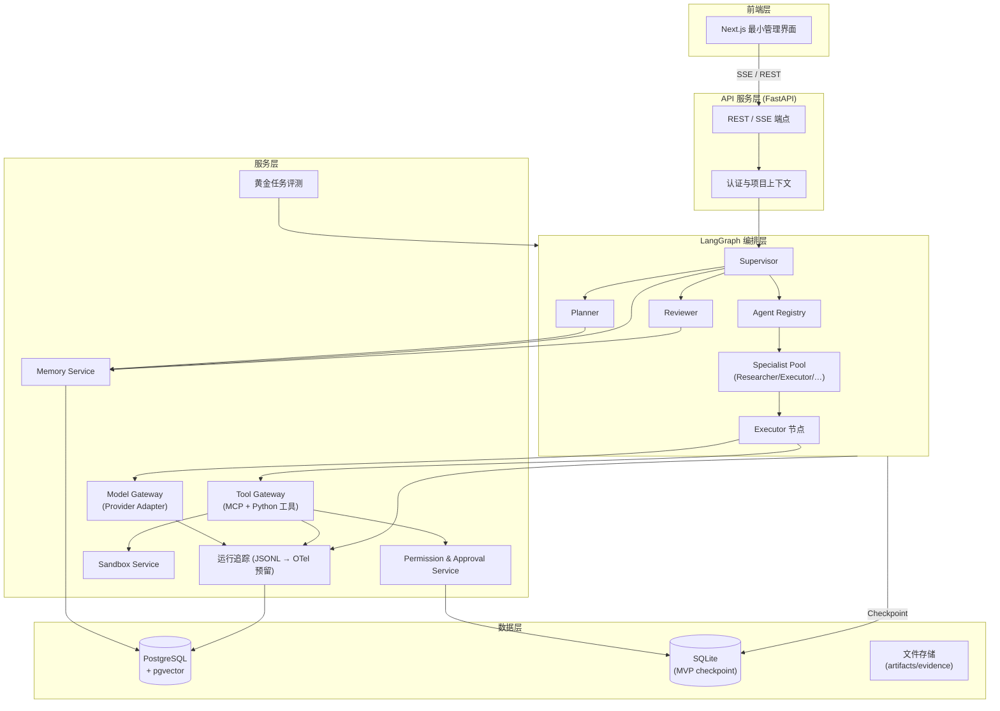
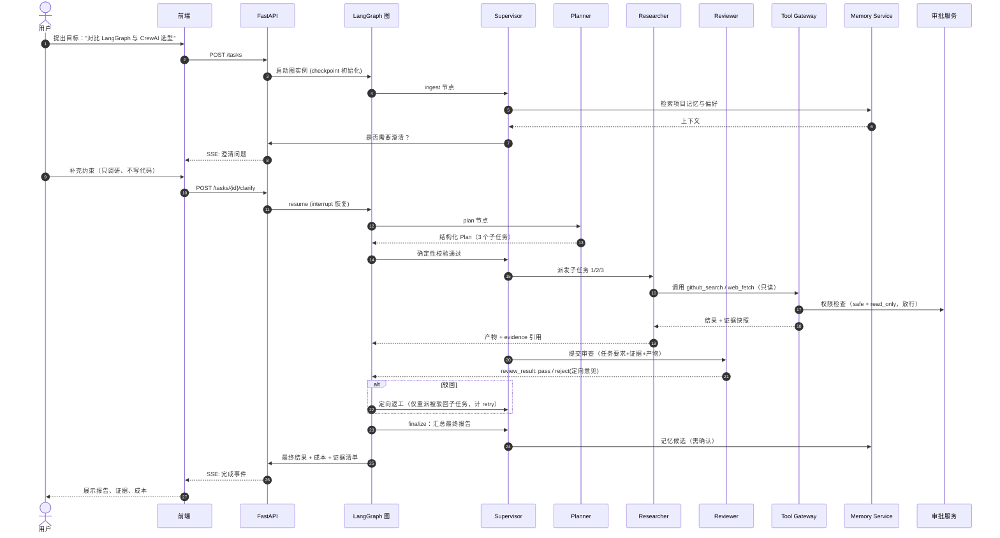

# AI Team OS 系统架构草案

> 文档状态：Phase 0 草案，待总管验收
> 版本：v0.1（2026-08-04）

## 1. 架构总览

分层原则：**前端薄、API 中、编排重、网关收口**。所有模型调用与工具调用分别经 Model Gateway 与 Tool Gateway 收口，保证可记账、可鉴权、可审计。

## 2. 组件职责

### 2.1 前端层
最小管理界面（Next.js + TypeScript）：任务创建、实时进度（SSE）、审批操作台、结果与证据查看、运行日志查看。MVP 只做只读 + 审批交互，不做可视化编排器。

### 2.2 API 服务层（FastAPI）
- REST：`POST /tasks`（创建任务时由 API 层写入 `token_budget`/`cost_budget` 任务总预算）、`GET /tasks/{id}`、`POST /tasks/{id}/approvals/{aid}`、`GET /tasks/{id}/events`（SSE）。
- 认证（MVP 单用户 token 即可）、项目上下文解析、请求参数校验（Pydantic）。
- 不做业务逻辑，仅做协议转换与流式转发。

### 2.3 LangGraph 编排层
- **图结构**：`ingest → clarify → plan → dispatch → execute(并行子图) → review → (通过→finalize | 驳回→rework 定向回到失败子任务) → finalize`。
- 每个节点是确定性 Python 函数，内部调用 LLM（经 Model Gateway）或工具（经 Tool Gateway）。
- Checkpoint 持久化所有状态，支持中断恢复与 HITL（`interrupt` 用于审批与澄清）。

### 2.4 Agent Registry
- 注册表：`agent_id → AgentSpec（角色、可用工具白名单、模型配置、Token 上限、SOP、禁止行为）`。
- 确定性代码实现，LLM 不能修改注册表本身；Supervisor 只能从中选择已注册的 agent。
- MVP 预注册 5 角色，扩展 Specialist 通过配置注册（M2+）。

### 2.5 Planner
- 输入：`clarified_goal + constraints + context(memory 检索结果)`。
- 输出：结构化 `Plan`（子任务列表：依赖图、每个子任务的 agent 候选、输入引用、产出定义、`subtask_budget_allocations`）。
- 产出经确定性校验（schema、依赖无环、`subtask_budget_allocations` 总和 ≤ 任务总预算）。

### 2.6 Supervisor
- 唯一持有"当前该做什么"决策的节点：选 agent、派发、处理失败与驳回、决定重试或降级。
- 不执行具体工作，不直接调用业务工具。
- 受硬性约束：总步数上限、每个子任务最多 N 次重派、禁止 agent 间直接互相调用（只通过 Supervisor 派发）。

### 2.7 Specialist Pool
- MVP：Researcher（调研、证据采集）、Executor（执行已批准的实施动作，写文件限沙箱）。
- 由 Supervisor 按任务类型从 Registry 选择实例化；无任务时不常驻运行（无默认常驻智能体）。

### 2.8 Executor
- 执行子任务步骤：读输入 → 规划动作序列 → 经 Tool Gateway 调用工具 → 收集证据 → 产出产物。
- 每次工具调用前后上报计数到预算记账器。

### 2.9 Reviewer
- 输入：原始子任务要求 + 证据 + 产物 + 禁止行为清单（**不接收 Executor 的中间推理**）；**证据与产物从受控状态存储读取，不经 Supervisor 重新总结或改写**。
- 双轨评审：确定性校验（schema/字数/证据条数/禁止字符串）+ LLM 评审（按评审清单）。
- 输出：`review_result（pass / reject + 定向修改意见）`；驳回时明确"哪个子任务、修什么、重交哪几项"。

### 2.10 Memory Service
- 项目级记忆：项目上下文、决策记录、用户偏好、已完成任务摘要。
- 写入：确定性规则过滤 + 人工确认（MVP）；读取：按 project_id 检索 + 关键词/元数据过滤（向量检索延后）。
- 数据模型：`memory(id, project_id, type, content, source_task_id, created_at)`。

### 2.11 Model Gateway
- 统一接口：`chat(messages, model_cfg, max_tokens, temperature) → (response, usage)`。
- Provider Adapter：OpenAI-compatible（`base_url` + `api_key` 可配置，天然支持 OpenAI/DeepSeek/Ollama 等兼容端点）。
- 记账：**Model Gateway 是预算使用量的唯一权威记账入口**；每次调用记录 token（input/output）、估算成本，工具调用成本也经此累加；累计进任务预算，超限即中断并触发降级策略。
- 预留：多 provider 路由（按成本/能力），MVP 只做单 provider + 配置切换。

### 2.12 Tool Gateway
- 统一 `ToolSpec`：`name, description, input_schema, risk_level(safe|sensitive|dangerous), read_only: bool, requires_approval: bool, execute()/handler`。
- MCP 工具：通过 MCP 客户端适配器把远端工具包装成 `ToolSpec`；普通 Python 工具直接注册成 `ToolSpec`——**两者在网关内完全同构**。
- 调用判定：safe+read_only 通常自动允许；sensitive 按工具与上下文决定是否审批；dangerous 必须确定性拦截（M1 中 handler 永不执行）。是否可写由 `read_only` 独立表达，不由 risk_level 表示。
- 所有调用必经：鉴权（权限级别 + 项目约束）→ 预算检查 →（高风险则）审批拦截 → 执行 → 结果与证据落盘。
- 失败语义统一：`tool_error(code, message, retryable)`，供恢复策略决策。

### 2.13 Permission and Approval Service
- 权限模型：`role → tool 白名单`；工具自带 `risk_level: safe|sensitive|dangerous` 与 `read_only: bool`、`requires_approval: bool`。
- 审批流：`approval(id, task_id, tool_name, args_summary, status=pending)` → 人工在控制台批准/拒绝 → 记录审计。
- 确定性强制：`dangerous` 工具在 Gateway 层硬拦截，**任何 LLM 都不能绕过**。

### 2.14 Sandbox Service
- MVP 定位：提供隔离工作区（目录 + 环境变量白名单），Executor 的文件读写默认限制在沙箱目录。
- 任意命令执行在 M3 之前保持禁用（代码执行逃逸是最高风险项，见 RISK_REGISTER）。
- 后续（M3）：Docker 容器隔离（本机无 Docker 时的降级策略：纯目录沙箱 + 工具白名单）。

### 2.15 数据层
- PostgreSQL + pgvector：任务/子任务/记忆/审批/审计的主库。**时间线（002-A）：M0-M3 一律 SQLite Checkpoint；PostgreSQL 在 M4 或出现多实例/复杂查询刚需时引入；pgvector 在 M4 真正启用向量检索时引入；Redis 在出现队列、跨进程锁或多实例需求后再决定；Docker Compose 只是部署选项，不是本地开发前置条件。**
- SQLite：MVP 的 LangGraph Checkpoint（M0-M3 一律 SQLite，零依赖、单机快）；PostgreSQL 适配器在 M4 或刚需时引入（接口抽象保持一致，部署配置切换）。
- 文件存储：`artifacts/`（产物）与 `evidence/`（工具调用结果快照、网页快照），按 task_id 组织；MVP 用本地目录。

### 2.16 运行追踪与评测
- 结构化 JSONL 运行日志：每次 LLM 调用、工具调用、状态转换、审批、驳回各一条事件，含 `task_id, node, ts, token/cost, latency`。
- OTel 接口预留（span 命名与 attribute 约定固定），M5 前不引入依赖。
- 评测：黄金任务脚本（GOLDEN_TASKS.md）驱动端到端运行，自动验收项由脚本断言。

### 2.17 实时通信
- **优先 SSE**：`/tasks/{id}/events` 推送事件流（进度、审批请求、最终结果）。
- WebSocket 仅在有双向需求（如运行中人工干预对话）时引入；MVP 无此需求，不实现。

## 3. 完整任务时序图（黄金链路：GitHub 调研任务）

## 4. 关键设计决策

| 决策 | 选择 | 理由 |
| -- | -- | -- |
| 编排核心 | LangGraph | durable execution + 原生 HITL（见 FRAMEWORK_REVIEW） |
| Checkpoint 起步 | SQLite（M0-M3），PostgreSQL M4 或刚需时引入 | 零依赖开发；时间线由 002-A 统一 |
| 模型接入 | 自研 OpenAI-compatible Adapter（可选 LiteLLM） | 供应商解耦、统一记账 |
| 工具统一 | ToolSpec 统一模型 + MCP 适配器 | MCP 工具与 Python 工具网关内同构 |
| 实时通信 | SSE 优先 | MVP 无双向需求 |
| 前端 | M5 前不启动 | 先锁定 API 契约与编排行为（见架构问题 #4） |
| 缓存/队列 | MVP 不用 Redis | 无队列需求；checkpoint 已持久化（见架构问题 #1） |
